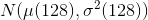

# BraTS_NvNet

This is an **unofficial** *Pytorch* implementation of BraTS_NvNet, based on **Andriy Myronenko's** paper on [**MICCAI_BraTS_2018_proceedings_shortPapers**](https://www.cbica.upenn.edu/sbia/Spyridon.Bakas/MICCAI_BraTS/MICCAI_BraTS_2018_proceedings_shortPapers.pdf)

## Overview

BraTS2018: [Multimodal Brain Tumor Segmentation Challenge 2018](https://www.med.upenn.edu/sbia/brats2018.html)

The participants are called to address this task by using the provided clinically-acquired training data to develop their method and produce segmentation labels of the different glioma sub-regions. **The sub-regions considered for evaluation are: 1) the "enhancing tumor" (ET), 2) the "tumor core" (TC), and 3) the "whole tumor" (WT)**.

Segmentation Labels:
  - WT: 2
  - TC: 1 
  - ET: 4
## Network

A combination of Vnet and VAE(variation auto-encoder).

**Table 1.** Encoder structure, where GN stands for group normalization(with group size of 8), Conv - 3\*3\*3 convolution, AddId - addition of identity/skip connection. Repeat column shows the number of repetitions of the block.

| Name | Ops | Repeat | Output size|
| :---- | :----------------: | :--: | :--------: |
| Input | | | 4\*160\*192\*128 |    
| InitConv | Conv | 1 | 32\*160\*192\*128 |
| EncoderBlock0 | GN, ReLU, Conv, GN, ReLU, Conv, AddId | 1 | 32\*160\*192\*128 |
| EncoderDown1 | Conv stride 2 | 1 | 64\*80\*96\*64 |
| EncoderBlock1 | GN, ReLU, Conv, GN, ReLU, Conv, AddId | 2 | 64\*80\*96\*64 |
| EncoderDown2 | Conv stride 2 | 1 | 128\*40\*48\*32 |
| EncoderBlock2 | GN, ReLU, Conv, GN, ReLU, Conv, AddId | 2 | 128\*40\*48\*32 |
| EncoderDown3 | Conv stride 2 | 1 | 256\*20\*24\*16 |
| EncoderBlock3 | GN, ReLU, Conv, GN, ReLU, Conv, AddId | 4 | 256\*20\*24\*16 |


**Table 2.** Decoder structure, where GN stands for group normalization(with group size of 8), Conv - 3\*3\*3 convolution, Conv1 - 1\*1\*1 convolution AddId - addition of identity/skip connection, UpLinear - 3D linear spatial upsampling. Repeat column shows the number of repetitions of the block.


| Name | Ops | Repeat | Output size|
| :---- | :----------------: | :--: | :--------: |
| DecoderUp2 | Conv1, UpLinear, +EncoderBlock2 | 1 | 128\*40\*48\*32 |    
| DecoderBlock2 | GN, ReLU, Conv, GN, ReLU, Conv, AddId | 1 | 128\*40\*48\*32 |
| DecoderUp1 | Conv1, UpLinear, +EncoderBlock1 | 1 | 64\*80\*96\*64 |    
| DecoderBlock1 | GN, ReLU, Conv, GN, ReLU, Conv, AddId | 1 | 64\*80\*96\*64 |
| DecoderUp0 | Conv1, UpLinear, +EncoderBlock0 | 1 | 32\*160\*192\*128 |    
| DecoderBlock0 | GN, ReLU, Conv, GN, ReLU, Conv, AddId | 1 | 32\*160\*192\*128 |
| DecoderEnd | Conv1, Sigmoid | 1 | 1\*160\*192\*128 |


**Table 3.** VAE decoder branch structure, where GN stands for group normalization(with group size of 8), Conv - 3\*3\*3 convolution, Conv1 - 1\*1\*1 convolution AddId - addition of identity/skip connection, UpLinear - 3D linear spatial upsampling, Dense - fully connected layer. Repeat column shows the number of repetitions of the block.

| Name | Ops | Repeat | Output size|
| :---- | :----------------: | :--: | :--------: |
| VD | GN, ReLU, Conv (16) stride 2, Dense (256) | 1 | 256\*1|
| VDraw | sample | 1 | 128\*1|
| VU | Dense, ReLU, Conv1, UpLinear | 1 | 256\*20\*24\*16 |
| VUp2 | Conv1, UpLinear | 1 | 128\*40\*48\*32 |    
| VBlock2 | GN, ReLU, Conv, GN, ReLU, Conv, AddId | 1 | 128\*40\*48\*32 |
| VUp1 | Conv1, UpLinear | 1 | 64\*80\*96\*64 |    
| VBlock1 | GN, ReLU, Conv, GN, ReLU, Conv, AddId | 1 | 64\*80\*96\*64 |
| VUp0 | Conv1, UpLinear | 1 | 32\*160\*192\*128 |    
| VBlock0 | GN, ReLU, Conv, GN, ReLU, Conv, AddId | 1 | 32\*160\*192\*128 |
| Vend | Conv1 | 1 | 4\*160\*192\*128 |

sample ~ 

## Dependencies

```
python: 3.6.2
pytorch: 0.4.1
pytables: 3.4.4
numpy: 1.13.1
tensorboardX: 1.4
nibabel: 2.3.0
nilearn: 0.4.2

```
## Usage

1. data preprocessing: 
  - change the directory of brats 2018 training dataset and validation dataset
  - set dataset format
  - run the script：
  ```
    python3 data_preprocess.py
  ```
2. train model: 
 - set training data file path
 - set training parameters
 - run the script:
  ```
    python3 main.py
  ```
3. predict:
  - set validation data file path
  - set model file path
  - run the script:
  ```
    python3 predict.py
  ```
4. make submission:
  - set prediction file path
  - set reconstruction parameters
  - run the script:
  ```
    python3 make_submission.py
  ```

## Implementation Details

- [x] NvNet 
- [x] Loss
- [x] DataLoader
- [x] Train
- [x] Predict
- [ ] Data Preprocess
- [ ] Make Submission
